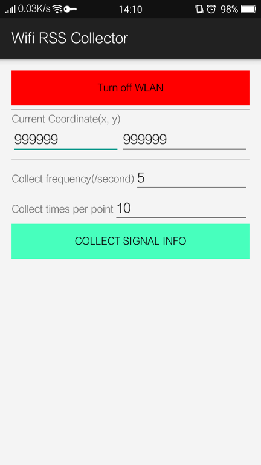
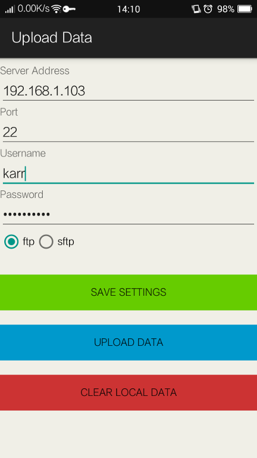

# Wifi Signal Collector

## 1. Functions

This is a simple android app that can do these things:
1. Collect wifi signals;
2. Save these signal data to csv files which locates at ${your phone storage}/002wifi/
3. Upload these csv files to the specific server through FTP or SFTP

### 1.1 Examples of the csv file:
2-1_2015-08-07.csv:

> x,y,ssid,bsid,level,timestamp
> 2,1,SweetMemory,c0:61:18:3c:41:5a,-45,270675396356
> 2,1,zyw,c8:3a:35:42:c7:d0,-71,270675396424
> 2,1,MERCURY_2.4G_E48B,6c:59:40:27:e4:8b,-75,270673158348
> 2,1,beyond,28:2c:b2:4e:1b:50,-73,270675396396
> 2,1,kekeismeinv,cc:34:29:46:93:f2,-79,270675396451
> 2,1,Feixun_0BBE14,f0:eb:d0:0b:be:14,-89,270675396478
> 2,1,my_wifi2333,6c:59:40:bd:f8:16,-90,270673158430
> 2,1,SweetMemory,c0:61:18:3c:41:5a,-45,270675396356
> 2,1,zyw,c8:3a:35:42:c7:d0,-71,270675396424
> 2,1,MERCURY_2.4G_E48B,6c:59:40:27:e4:8b,-75,270673158348

### Screenshots

## 2. Project Detail

This project is developed in Android Studio

## 3. License
[GPL v2](./LICENSE)
